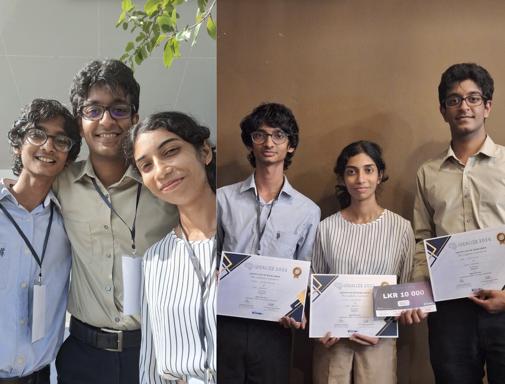
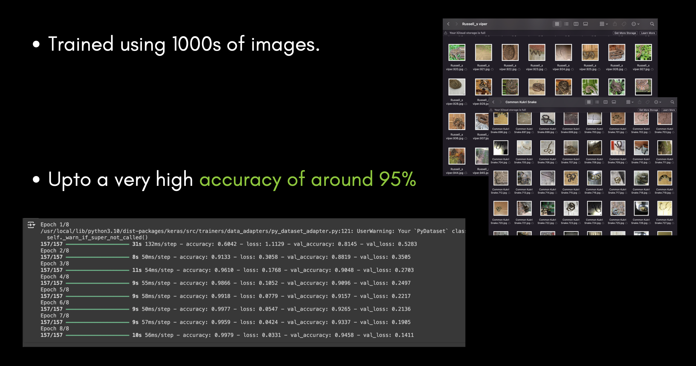
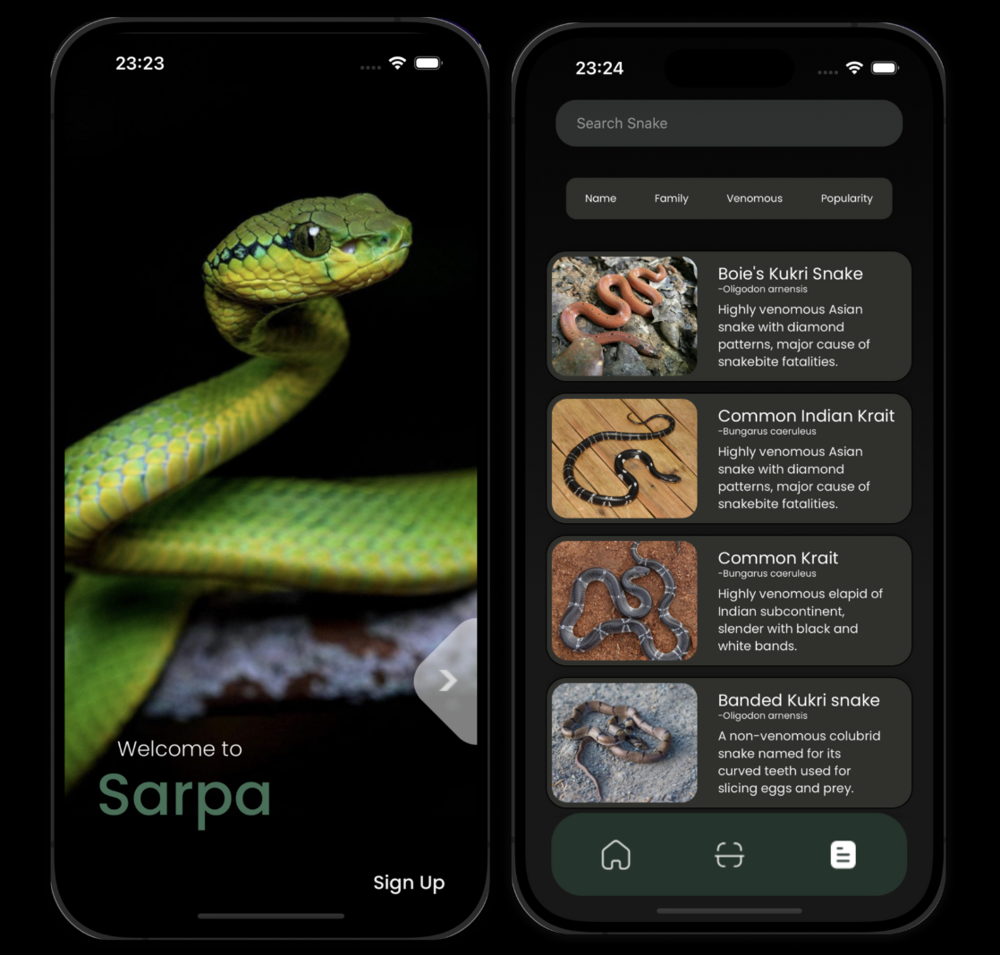

# 🐍 SarpaV5 - Snake Identification App

Sarpa is a mobile application built with **React Native (Expo)** that enables users to identify Sri Lankan snakes using image recognition powered by a **TensorFlow AI model**. It provides details such as **probability of identity**, **preventive measures**, **first aid**, and a **snake portfolio**.

> 🎓 I started this project at the end of my **1st year** together with some of my friends.

---

## 🏆 Achievements

- 🥉 **Finalists** at **Idealize 2024**
- 🌿 **Winner** of the **Sixth Flow Award** — awarded for the most **environmentally impactful** innovation

  

---

## ✨ Features

- 📷 Upload or capture snake images (camera capture disabled on iOS simulator)
- 🧠 AI-powered image classification using MobileNetV2
- 📚 Local database of 7 trained snake species
- 🔍 Snake details with images, first aid, and risk levels
- 🗺️ Clean UI and smooth navigation experience

  

## 🛠️ Tech Stack

### Frontend (App)
- **Framework:** React Native with Expo CLI
- **Navigation:** `@react-navigation/native`
- **Image Uploading:** `react-native-image-crop-picker`
- **Styling:** HTML + CSS via React Native components
- **Custom Fonts:** Expo Fonts

### Backend (AI Model)
- **Library:** TensorFlow + Keras (Python)
- **Model Architecture:** Transfer Learning using **MobileNetV2**
- **Training Method:**
  - Last 7 layers unfrozen and retrained
  - Trained on **7 Sri Lankan snake species**
  - ~250 images per species, augmented to 1000+ using data augmentation
  - Accuracy: **98% test**, **93% validation**
- **Hosting:** Currently served from a local Flask server

  

---

## 🧪 Model Training Pipeline

- Trained in **Google Colab** using a `.ipynb` notebook
- Image data augmented (rotation, flipping, brightness)
- 4 epochs on a moderate dataset
- Not deployed to mobile app due to performance and size limitations

---

## 🖼️ Screenshots

### 🔍 App Preview 

  

---

## 🚀 Future Improvements

- ✅ Host AI model on a cloud server (e.g., AWS/GCP)
- 📡 Enable real-time inference through API
- 📲 Integrate lightweight on-device inference (e.g., TFLite)
- 🌍 Expand database with more snake species
- 📊 Include map-based sightings and risk levels

---
